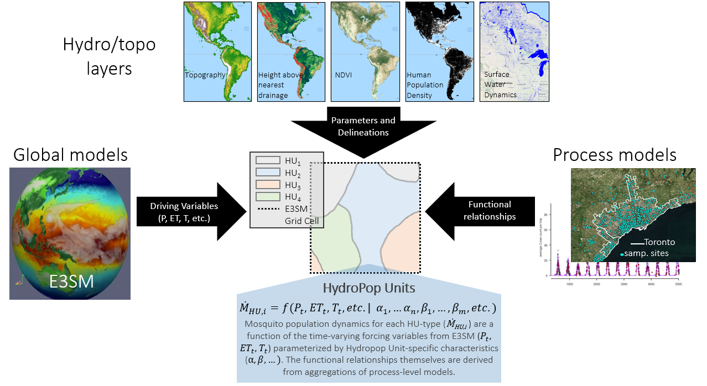

## ecopop

> What are "ecopop units?"

Ecopop units (EUs) are spatially continuous regions that feature similar habitat potential ("eco") and human population ("pop") density. Think “typologies”; EUs were designed to serve as the “grid cells” that bridge the scale gap between an Earth System Model's grid cells (fractions of a degree) and local, process-based population dynamics models (sometimes at-a-point).

Note that "ecopop" was derived from an earlier version called "hydropop," so some figures may refer to "hydropop" or "HPU."

<p align="center">
<a href='https://lanl.github.io/ecopop'></a>
</p>

### Setup

```shell
conda env create -f environment.yml # environment file in repo
pip install git+ssh://git@github.com/VeinsOfTheEarth/rabpro.git
```

### Usage

```shell
python ecopop/dev/end_to_end_new.py
```

### Documentation

For installation instructions and descriptions of outputs, see the [docs](https://lanl.github.io/ecopop/).

### Development

```shell
# build docs
pip install -r docs/requirements.txt
cd docs && sphinx-build -M html source build
```

### License

This repo is released with a [BSD-3 License](https://github.com/lanl/ecopop/blob/main/LICENSE).


### Copyright
© 2022. Triad National Security, LLC. All rights reserved.

This program was produced under U.S. Government contract 89233218CNA000001 for Los Alamos National Laboratory (LANL), which is operated by Triad National Security, LLC for the U.S. Department of Energy/National Nuclear Security Administration. All rights in the program are reserved by Triad National Security, LLC, and the U.S. Department of Energy/National Nuclear Security Administration. The Government is granted for itself and others acting on its behalf a nonexclusive, paid-up, irrevocable worldwide license in this material to reproduce, prepare derivative works, distribute copies to the public, perform publicly and display publicly, and to permit others to do so.

